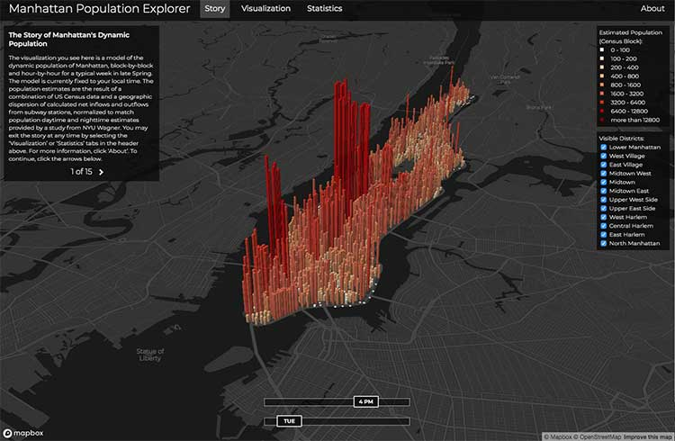

# Lab 0 Work

## by Lini
Beginning of Interactive Data Visualization Labs

### Learning Goals
<br>

#### Tracking Progress
<table>
      <thead>
        <tr>
          <th>Goals</th>
          <th>Progress</th>
        </tr>
      </thead>
      <tbody>
        <tr>
          <td>Working with Git, GitHub, Observable framework</td>
          <td>Initiated work in Class 3</td>
        </tr>
        <tr>
          <td>Learning HTML, CSS, JS</td>
          <td>Initiated work in Class 4</td>
        </tr>
        <tr>
          <td>Complete Lab 0</td>
          <td>Deadline set for Class 5</td>
        </tr>
      </tbody>
</table>
<br>

#### Challenges
  <ul>
    <li>Understanding the tools</li>
    <li>Grasping the concepts behind the visualizations</li>
    <li>Deciphering the code</li>
    <li>Not getting lost in the details</li>
  </ul>

#### Learning Plan
<ol>
    <li>One step at a time</li>
    <li>Utilize available documentation</li>
    <li>Code, test, fix, retest</li>
    <li>Research, research, research</li>
  </ol>

#### Sample Interactive Data Visualization
<br>



<br>
<br>

```js
const name = view(
  Inputs.text({
    label: "Name",
    placeholder: "Enter your name"
  })
);
```
Welcome to Interactive Data Visualization ${name}